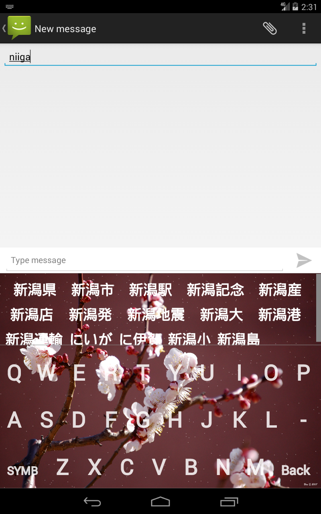

Input Method Editor on Android.
===
Prerequisites
---
  - [Android Studio 2.2](https://developer.android.com/studio/index.html)
  
Get the code
---
``` batch
git clone --recursive https://github.com/negishu/NegiIME-AndroidStudio-.git
```
Screen Shots
-----------



or [download from GitHub](https://github.com/negishu/NegiIME-AndroidStudio-).
